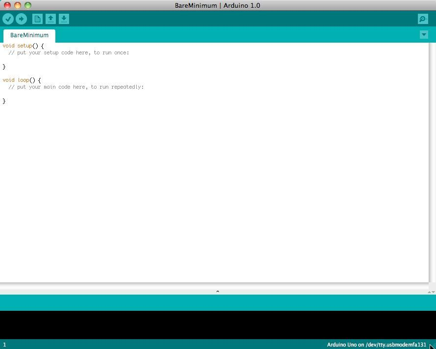

# Instalar Arduino IDE

Lo primero será instalar el **Arduino IDE** con el que podremos desarrollar nuestras aplicaciones e instalarlas en nuestra placa.

Este IDE es muy simple lo cual es perfecto para hacer pequeños programas de forma rápida y sencilla al no tener que configurar nada.

Dependiendo de tu sistema operativo deberás seguir una guía u otra:

- [Windows](arduinoide/instalacion/windows.md)
- [GNU/Linux](arduinoide/instalacion/linux.md)
- [Mac OS X](arduinoide/instalacion/macosx.md)

