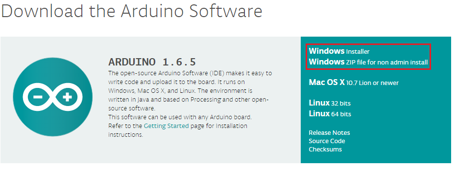
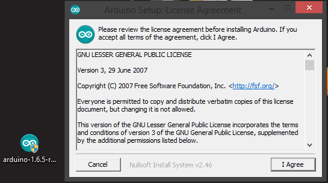
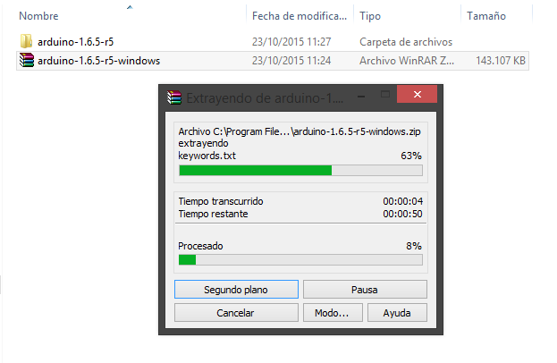
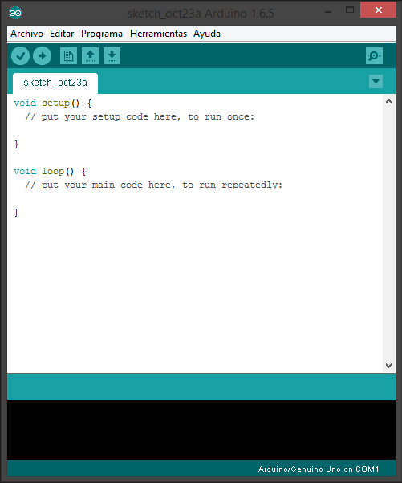

# Windows

Para instalar el entorno en un sistema Windows, debemos descargalo de la página oficial de Arduino. [arduino.cc](http://www.arduino.cc/en/Main/Software)

Hay dos formas diferentes de instalarlo, utilizando el instalador o descargándolo en formato ZIP. Si descargamos el instalador, bastará con ejecutarlo y seguir los pasos de la instalación.

Si descargamos el ZIP, bastará con descomprimirlo en la carpeta en la que queramos tener el entorno instalado.

Ahora simplemente hay que ejecutarlo, independientemente de la opción elegida.

