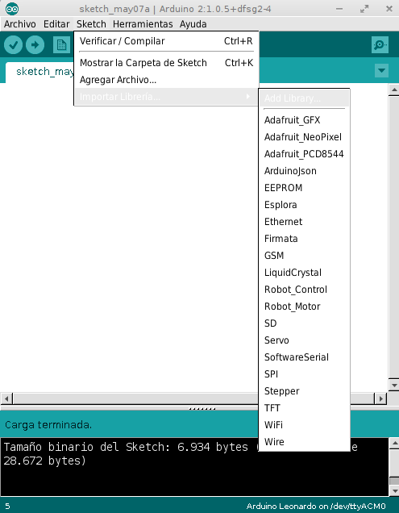

# Bibliotecas

Si bien Arduino incluye gran cantidad de bibliotecas instaladas de serie, en muchas ocasiones tendremos que instalar
bibliotecas adicionales para realizar ciertas tareas.

Para instalar nueva biblioteca basta con descargarla e instalar el _zip_ desde

`Sketch -> Importar Librería -> Add Library`.

En determinadas ocasiones, si el _zip_ contiene guiones o espacios da fallo, por lo que recomendable renommbrar el fichero.

Para descargar las bibliotecas alojadas en **GitHub** basta con pulsar en **Donwload Zip**.