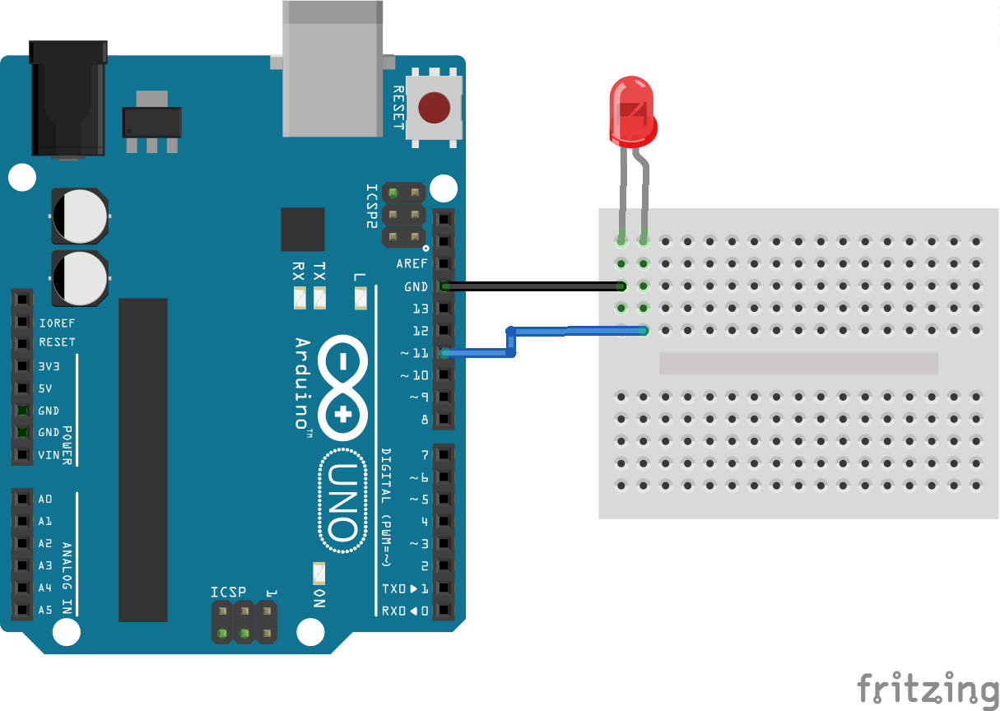

# Blink

El _blink_ es el ejemplo más básico de programación en Arduino. Consiste en hacer parpadear un LED.

Para ello, deberemos conectar el LED como sigue este esquema:



Y tendremos que usar este código

```c++

//Pin en el que conectaremos el LED
#define PIN 11

void setup() {
    //Ponemos el pin en modo salida
    pinMode(PIN, OUTPUT);

}

void loop() {

    //Encendemos el LED
    digitalWrite(PIN, HIGH);

    //Esperamos 1 segundo
    delay(1000);

    //Apagamos el LED
    digitalWrite(PIN, LOW);

    //Esperamos 1 segundo
    delay(1000);
}
```
